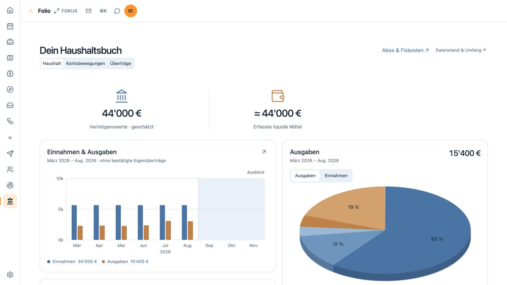
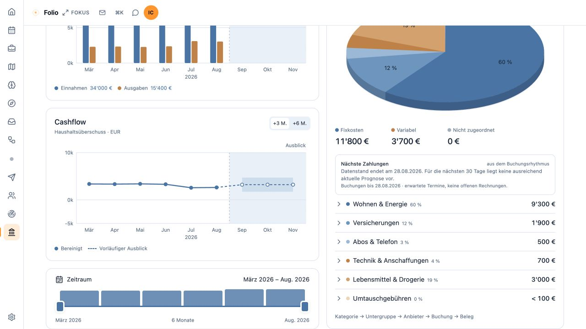

# Folio

**0.6.0-preview.1 — public preview · 25 September 2026.** AGPL-3.0.

Folio connects a locally processed inbox with traceable sources, a calendar and a household overview. Confirmed knowledge, model proposals and permitted actions remain separate.

Ledger presents income, expenses and cash flow for a selected period, with expandable categories leading to individual transactions and statements. Confirmed transfers between the user's accounts are excluded from household income and spending. Estimates and missing evidence remain visible.

The inbox separates decisions from completed automation and technical work still pending. The application tracker brings together open applications, contacts and responses. Unambiguous rejection messages can update the matching application; uncertain matches remain open for review. Calendar proposals require approval before creating an event. Subscription records retain the distinction between known terms, payment evidence and unresolved status.

Ledger is an overview based on imported sources, not audited accounting, tax advice, a bank connection or a trading platform. Support for specific formats does not mean universal support for every statement from that provider. Missing sources and uncertain matches remain unresolved. Module chat retains only its enabled tools. Google Calendar is an optional, explicitly configured OAuth integration and communicates with Google when enabled; there is no Google access without that integration. Screenshots use synthetic data. Ledger figures are calculated from verified fixtures; inbox, calendar and career screenshots use presentation fixtures and do not demonstrate a live provider workflow or model accuracy.

An optional local model comparison bench for mail triage uses an explicitly provided test cohort and the separately configured local multi-agent runtime.

## Preview





[More screenshots and their data boundaries](docs/screenshots/v0.6.0-preview.1/README.md) · [Release notes](https://github.com/aion-lumen/folio/releases/tag/v0.6.0-preview.1)

## Run locally

Node.js 20 or later. This candidate was built and checked on macOS with Node 20. A local Hermes/model runtime and source-specific adapters are optional and are not installed by these commands.

```sh
npm ci
npm run check
npm test
npm run build
ORIGIN=http://127.0.0.1:4173 HOST=127.0.0.1 PORT=4173 node build/index.js
```

Open the same origin, `http://127.0.0.1:4173`. With no configured sources, Folio displays setup/unavailable states, not invented data. Configure optional mail, career, statement and calendar sources according to [source configuration](docs/source-configuration.md). Mail credentials and worker infrastructure are configured separately; an account label alone does not connect a mailbox.

## Upgrade and rollback

Stop the old runtime and any intake jobs. Back up the Folio SQLite database using a SQLite backup operation (or after all writers have stopped), the vault, source configuration and external tracker before starting the new version. Keep the former runtime. Preserve every account id and add formerly implicit accounts to the complete explicit registry before switching. Existing career identity keys can be retained with the documented setting.

The synthetic upgrade test starts with the v0.5.0 schema, preserves source-linked confirmed knowledge, and restores the old backup with v0.5.0. It is not a test of every personal adapter. To roll back, stop the new runtime, restore the old configuration and data backup, and start the old runtime; do not point the old version at a migrated database.

## Included interfaces and limits

Existing campaign/vault, module chat, manual mail import, read-only metrics and import-inbox paths remain. Optional modules are controlled by the [module registry](docs/module-registry.md). [The import format](FOLIO-IMPORT.md), [vault layout](docs/VAULT.md), [relay protocol](docs/session-relay.md), and [dependency policy](docs/dependency-security.md) describe their boundaries.

This preview excludes personal deployment scripts, private reorganisation workflows, experimental voice and new social publishing routes. Google access is optional and external. No universal offline claim is made for enabled integrations. Public author websites in the inherited metrics map are not receiving mail accounts.

All demo data are fictional. Presentation images from an earlier preview are illustrative and are not proof of this candidate's provider workflows. The release review separately records synthetic browser tests through the actual application handlers.

Part of [Aion Lumen](https://aion-lumen.ch/folio).
