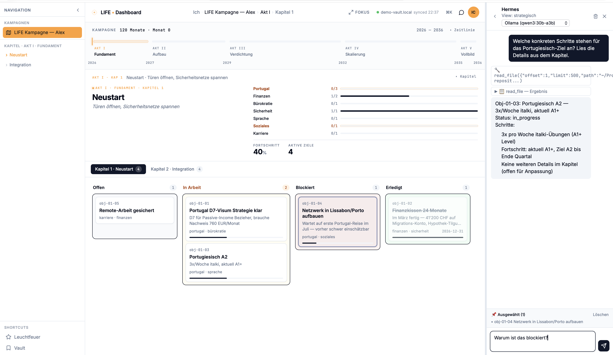
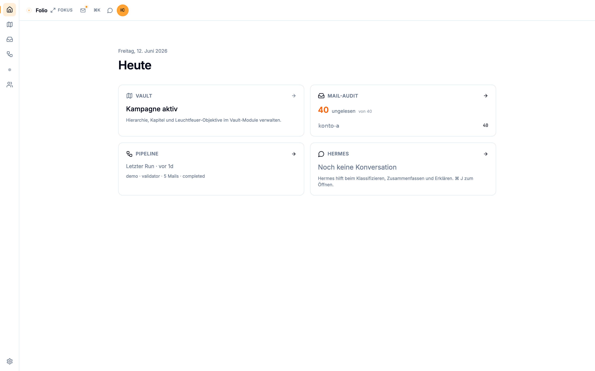
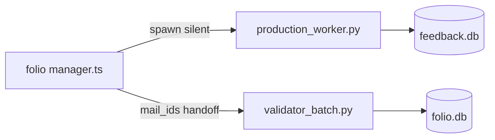

<div align="center">
  <picture>
    <source media="(prefers-color-scheme: dark)" srcset="assets/beacon-light.svg">
    
  </picture>
  <h1>Folio</h1>
  <p><strong>A markdown vault as memory. A local AI agent as your strategy partner.</strong></p>
  <p>Part of <a href="https://aion-lumen.ch">Aion Lumen</a>.</p>
</div>

---

> A vault as memory.  
> A campaign as structure.  
> A hearth at the center.

## Why Folio exists

Folio began with a simple need: a second brain that would not disappear at the end of an AI
session. A local Markdown vault became the durable memory; a campaign gave that memory direction
through chapters and concrete objectives. From the beginning, the vault separated material into
`open`, `internal`, and `restricted` layers. That boundary became Folio's first governance rule.

But a memory that is maintained by hand goes stale. Much of the work that changes a life or a
project arrives through email, so Folio grew a read-only mail connection and a local multi-model
pipeline that can sort incoming messages, surface uncertainty, and bring relevant work back into
the campaign. The vault is the memory, the campaign is the structure, and mail is one of the flows
that keeps both current.

That connection is deliberately local-first. As mail, local models, and session handoffs were
added, the original boundary had to remain valid across every new interface. Models may assess and
propose; source trust, capabilities, review gates, and audit determine what is allowed to become
part of the record. Plain Markdown remains the portable source of truth. The full story is at
[aion-lumen.ch/folio](https://aion-lumen.ch/folio).

## Status

**Status:** v0.5.0 public preview<br>
**License:** AGPL-3.0<br>
**Platforms:** Linux / macOS / WSL2

Seven public version tags are available from `v0.1.0` through `v0.5.0`; see the
[public tags](https://github.com/aion-lumen/folio/tags) and [changelog](CHANGELOG.md).

## Stack

- SvelteKit 2 + Svelte 5 (Runes), Tailwind CSS 4
- SQLite (local, file-based) via better-sqlite3 — no DB server
- Local LLMs via Hermes Agent (Nous Research) and LM Studio
- Cytoscape.js for graph visualisations

## Leuchtfeuer

The Heute hub carries a **Leuchtfeuer** card: site page-request & repo reach metrics derived from
**server logs only** — no client-side tracking, no cookies, no external analytics, so the
sites' zero-external-calls promise stays literally true. IP addresses are anonymised at parse
time and raw logs are dropped after 7 days. folio reads the aggregates read-only from
`~/.folio/metrics/` and degrades gracefully to the last known state when they are missing.
Collector, cron, and deployment details live in [`ops/leuchtfeuer/README.md`](ops/leuchtfeuer/README.md).

## Quick Start

**Prerequisites:** Node.js 20+. The demo vault runs fully self-contained — no
Hermes needed. A running [Hermes Agent](https://github.com/NousResearch/hermes-agent)
is only required for the AI chat / full operation (see below).

```bash
git clone https://github.com/aion-lumen/folio.git
cd folio
npm install
npm run build
npm run preview
```

Open `http://localhost:4173` and follow the Setup Wizard. On first launch you can connect an existing vault, start from a demo vault, or create one from scratch.

**Environment** — create `.env` in the project root:

```env
VAULT_PATH=/path/to/your/vault
HERMES_API_URL=http://localhost:8642
HERMES_API_KEY=your-key-here
```

For vault layout and mail integration, see [docs/VAULT.md](docs/VAULT.md) and
[docs/MAIL.md](docs/MAIL.md). Optional domains are constrained by the
[module registry and capability boundary](docs/module-registry.md). Dependency audit policy and
reviewed upstream constraints are documented in [docs/dependency-security.md](docs/dependency-security.md).

## Import inbox & LLM triage

External agents deliver Markdown to `~/.folio/inbox/` per [FOLIO-IMPORT.md](FOLIO-IMPORT.md) (public spec: [aion-lumen.ch/folio/import-spec.md](https://aion-lumen.ch/folio/import-spec.md)). Folio validates, optionally runs local LLM triage (LM Studio), and can auto-create campaign objectives when confidence is high — but only from **trusted sources** (`config/trusted_sources.yaml`); anything `derived_from_external` always goes to manual review.

The mail pipeline can also deliver **job-leads** (`type: lead`): freelance/project opportunities that surface on the Heute hub ("Fristnahe Leads", deadline ≤ 48h) and, on review-commit, become objectives in the current chapter.

```env
LM_STUDIO_BASE_URL=http://127.0.0.1:1234
FOLIO_AGENT_MODEL=qwen3-30b-a3b-thinking-2507   # tune via npm run eval:triage
FOLIO_AGENT_CONFIDENCE=0.8
FOLIO_AGENT_AUTO=0   # opt-in; button trigger is default
```

```bash
npm run eval:triage   # compare models × prompts on fixtures (requires LM Studio)
```

Preview and commit in the UI: **Heute → Import-Inbox** or `/inbox`.

## Demo (mock data)

Bundled demo of the full pipeline against isolated `*-demo.db` files on port `5174` — your real `~/.folio` is untouched. Prerequisites: seed the demo state from multi-agent-lab first (see [Demo (full stack)](#demo-full-stack) below).

```bash
bash scripts/demo-server.sh
```

Then open `http://localhost:5174/pipeline` (Pipeline page).

## Demo (full stack)

Full pipeline demo (folio UI + multi-agent worker simulation) — no IMAP, no LLM, no real data. Reproducible end-to-end against a fictional Alex + Maya household in the Algarve.

For an assisted cold start on a second Apple Silicon Mac, follow
[`docs/second-device-demo.md`](docs/second-device-demo.md).

1. **Clone both repos** side-by-side:
   ```bash
   git clone https://github.com/aion-lumen/folio.git
   git clone https://github.com/aion-lumen/multi-agent-lab.git
   ```
2. **Seed the demo DBs** in multi-agent-lab. This populates the isolated `*-demo.db` files (folio + feedback) with the demo content:
   ```bash
   cd multi-agent-lab
   python3 -m venv .venv && source .venv/bin/activate
   pip install -r requirements.txt
   cp config/user_context.example.yaml config/user_context.yaml
   cp config/regelwerk.example.yaml config/regelwerk.yaml
   make demo
   ```
3. **Start the folio demo server** (isolated `*-demo.db`, port 5174):
   ```bash
   cd ../folio
   npm install
   bash scripts/demo-server.sh
   ```
4. **Open** `http://localhost:5174/pipeline` — Pipeline page should render with seeded worker runs and validator opinions.

See [docs/quickstart.md](docs/quickstart.md) for the demo's environment variables and what each `*-demo.db` file holds.

## Screenshots

Captured against the bundled demo state (fictional Alex + Maya household in Algarve, no real data). Reproducible end-to-end — see [multi-agent quickstart](https://github.com/aion-lumen/multi-agent-lab/blob/main/docs/quickstart.md) for the `make demo` workflow.

<p align="center">
  
  <br><sub><em>Campaign dashboard — five-act timeline, chapter kanban, and the Hermes chat panel reading the vault live.</em></sub>
</p>

<p align="center">
  
  <br><sub><em>Heute dashboard — four cards as entry points (vault, mail-queue, pipeline, hermes chat).</em></sub>
</p>

### Mail pipeline (reference architecture)

Folio orchestrates the Python pipeline in [multi-agent-lab](https://github.com/aion-lumen/multi-agent-lab):



Set `AION_LUMEN_PATH` if the repo is not at `~/Projects/aion-lumen/multi-agent`. See multi-agent `docs/quickstart.md` for an offline demo.

## What works today

- Portable memory — plain Markdown + YAML frontmatter as the source of truth
- Campaign workspace — acts, chapters, objectives, Kanban, history and weekly focus
- Read-only-first mail pipeline — local classification, visible disagreement and review queue
- Import inbox — validated interchange documents, source-trust policy and local LLM triage
- Hermes integration — manifest-selected vault context, traceable sessions and execution profiles
- Module foundation — deny-by-default capabilities, route/database guards and kill switches
- Folio-owned memory — confirmed facts with provenance, temporal history and domain-scoped context
- Session Relay — provider-neutral handoffs with exact cloud approval and reviewed return paths
- Career-mail workflow — a Mail Queue case can return as an editable draft, context question,
  Objective proposal or explicit no-action conclusion; Folio never sends it automatically
- Sonar preview — local review of X archive and following imports with append-only human decisions
- Leuchtfeuer — privacy-preserving, visually attributed site and repository resonance from server
  aggregates, without client tracking
- Isolated demo — fictional fixtures and separate `*-demo.db` state, without IMAP credentials

## What is being built next

- **Operational learning** — use the career Relay in daily work before expanding its adapters or
  turning the optional Redaction Gate into a default workflow
- **Memory evaluation** — compare disposable graph/RAG projections against Folio's small canonical
  facts-and-FTS baseline, using questions produced by real Relay cases
- **Measured local delegation** — move suitable routines from long-running online sessions to local
  agents only after their quality has been observed against the same contracts
- **Mobile review** — consider a small approval and correction surface once the desktop workflow
  and backend contracts have proved stable in use

These items are post-`v0.5.0` development direction, not promises of the current release. See
[docs/ROADMAP.md](docs/ROADMAP.md) for gates, sequencing and the full roadmap.

## Contributing

Built by one person. Slow on purpose. Issues and pull requests welcome.

This is a solo project — contemplative pace, not startup velocity. If something is broken or missing, [open an issue](https://github.com/aion-lumen/folio/issues).

## Acknowledgements

- [Andrej Karpathy](https://karpathy.ai/) for thinking out loud about local knowledge bases
- [Nous Research](https://nousresearch.com/) for Hermes Agent
- [nesquena](https://github.com/nesquena) for Hermes Web UI
- 11 bit studios for Frostpunk 2 (mental model)

## License

AGPL-3.0 — see [LICENSE](LICENSE).

Design assets (Aion Lumen mark, color system) are CC BY 4.0.

---

Folio provides the engine. The course is yours.

— afm.
