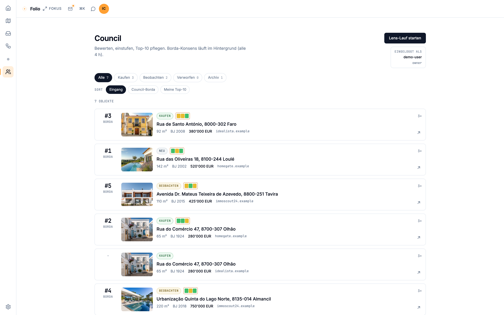
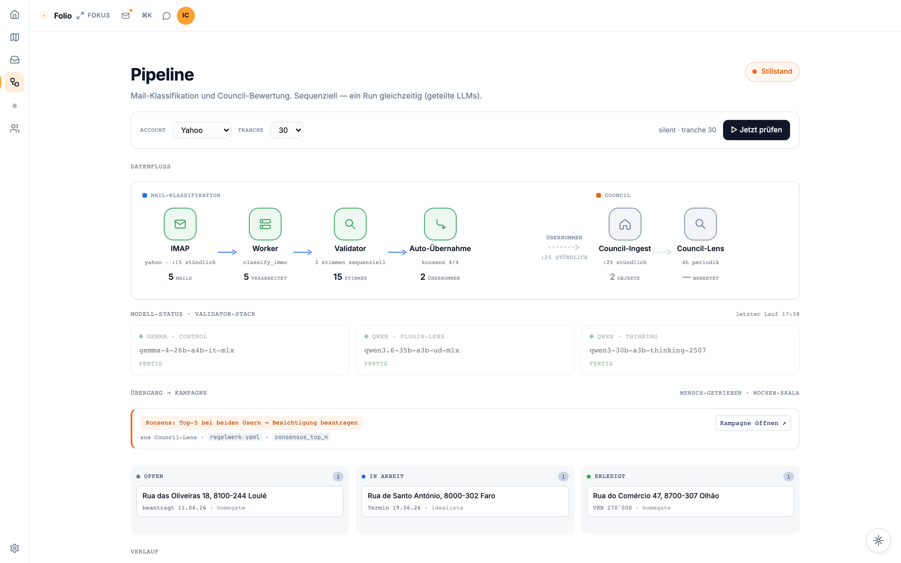
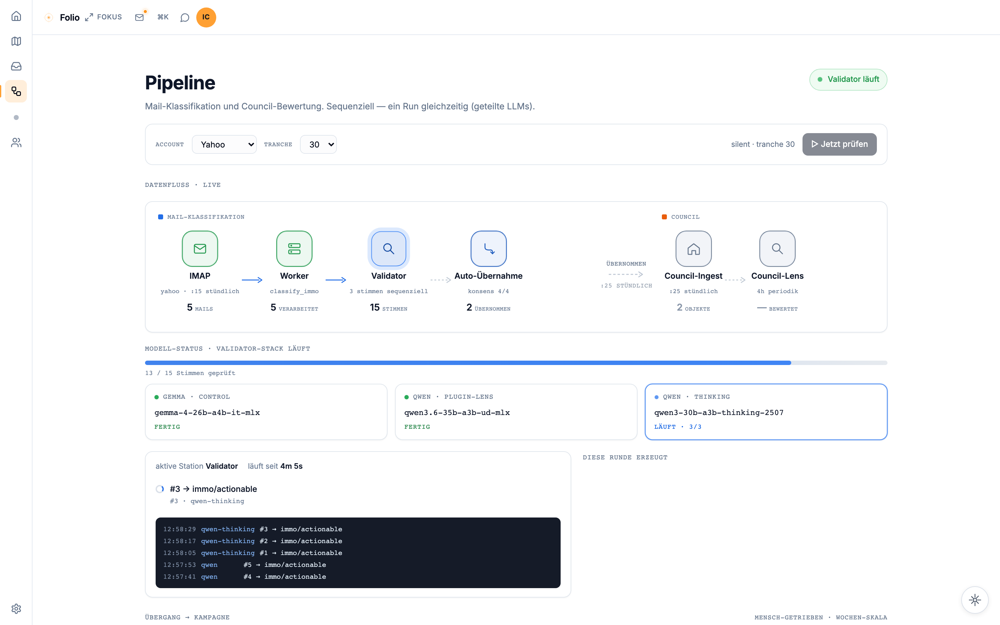
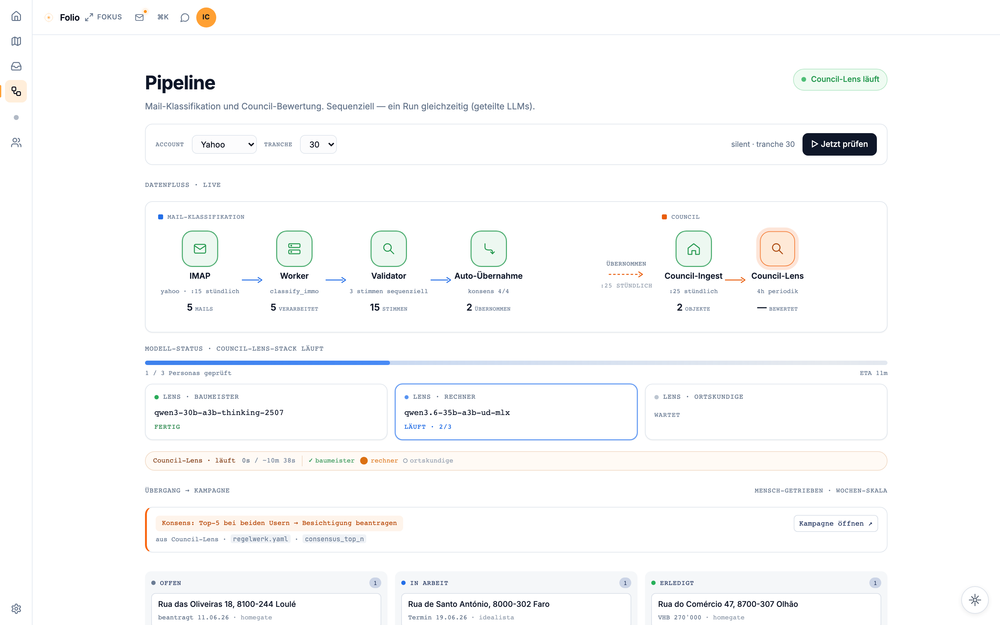
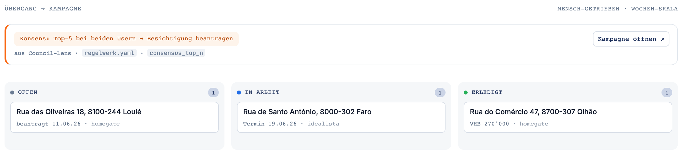
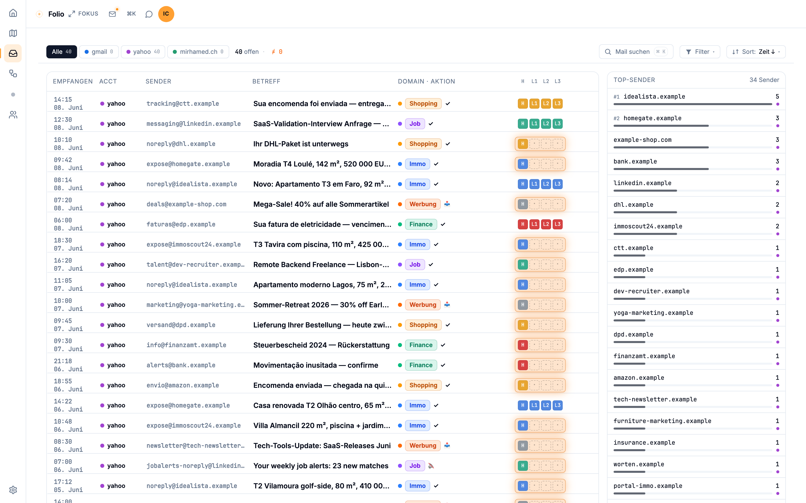
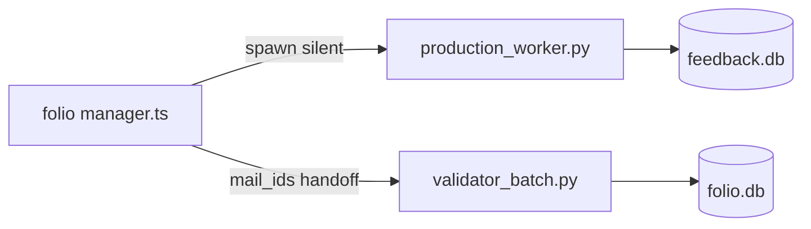

<div align="center">
  
  <h1>Folio</h1>
  <p><strong>A markdown vault as memory. A local AI agent as your strategy partner.</strong></p>
  <p>Part of <a href="https://aion-lumen.ch">Aion Lumen</a>.</p>
</div>

---

> A vault as memory.  
> A campaign as structure.  
> A hearth at the center.

## Why Folio exists

Cloud AI forgets you at the end of every session. You start over. Every time. Folio is the generator that keeps the heat on: a local markdown vault holds your full context, a locally-running AI agent reads it directly, and nothing leaves your machine. Markdown as source of truth — no lock-in, no subscription. The full story is at [aion-lumen.ch/folio](https://aion-lumen.ch/folio).

## Status

**Status:** v0.1.0 public preview  
**License:** AGPL-3.0  
**Platforms:** Linux / macOS / WSL2

## Stack

- SvelteKit 2 + Svelte 5 (Runes), Tailwind CSS 4
- Drizzle ORM + PostgreSQL (optional, for session persistence)
- Local LLMs via Hermes Agent (Nous Research)
- Cytoscape.js for graph visualisations

## Quick Start

**Prerequisites:** Node.js 20+, [Hermes Agent](https://github.com/NousResearch/hermes-agent) installed and running.

```bash
git clone https://github.com/aion-lumen/folio.git
cd folio
npm install
npm run build
npm run preview
```

Open `http://localhost:4173` and follow the Setup Wizard. On first launch you can connect an existing vault, start from a demo vault, or create one from scratch.

**Environment** — create `.env` in the project root:

```env
VAULT_PATH=/path/to/your/vault
HERMES_API_URL=http://localhost:8642
HERMES_API_KEY=your-key-here
```

For vault layout and mail integration, see [docs/VAULT.md](docs/VAULT.md) and [docs/MAIL.md](docs/MAIL.md).

## Screenshots

Captured against the bundled demo state (fictional Alex + Maya household in Algarve, no real data). Reproducible end-to-end — see [multi-agent quickstart](https://github.com/aion-lumen/multi-agent-lab/blob/main/docs/quickstart.md) for the `make demo` workflow.

<p align="center">
  
  <br><sub><em>Heute dashboard — four cards as entry points (vault, mail-queue, pipeline, hermes chat).</em></sub>
</p>

<p align="center">
  
  <br><sub><em>Council — properties ranked by three lens personas (Borda-aggregated), cluster-aware (cross-portal same-address detection).</em></sub>
</p>

<p align="center">
  
  <br><sub><em>Pipeline overview — data-flow diagram (IMAP → Worker → Validator → Auto-Übernahme → Council-Ingest).</em></sub>
</p>

<p align="center">
  
  <br><sub><em>Validator mid-run — three blind LLM voices (gemma · qwen · qwen-thinking), 13 / 15 Stimmen geprüft. Delphi-Prinzip: each voice classifies independently.</em></sub>
</p>

<p align="center">
  
  <br><sub><em>Council-Lens mid-run — three personas evaluate property candidates (Borda voting → consolidated Top-10).</em></sub>
</p>

<p align="center">
  
  <br><sub><em>Verlauf detail — per-run Lauf-Spur with Block-Gründe breakdown and a sample of imported mails.</em></sub>
</p>

<p align="center">
  
  <br><sub><em>Hauskauf campaign — kanban over the candidates that passed the 4/4 consensus (heuristik + 3 LLM voices).</em></sub>
</p>

<p align="center">
  
  <br><sub><em>Mail queue — domain × actionability tags, sender ranking, search + filters.</em></sub>
</p>

### Mail pipeline (reference architecture)

Folio orchestrates the Python pipeline in [multi-agent-lab](https://github.com/aion-lumen/multi-agent-lab):



Set `AION_LUMEN_PATH` if the repo is not at `~/Projects/aion-lumen/multi-agent`. See multi-agent `docs/quickstart.md` for an offline demo.

## What works today

- Strategic view — campaign banner, all five acts, active chapter
- Tactical view — kanban with drag-and-drop, gantt, objective selection
- Objective detail panel — status, deadline, progress note, history
- Hermes chat — agent reads and edits vault files via tool calls
- Vault format — plain markdown + YAML frontmatter, git-friendly
- Setup wizard, demo vault, model switcher

## What's coming

- **v0.2** — Voice input (STT), interview-style setup wizard, mobile PWA, approval UI for risky tool calls
- **v0.3** — Frostpunk view: generator metaphor, resource decay, harder visual atmosphere
- **v1.0** — Multi-user, NAS deployment, public vault templates

See [docs/ROADMAP.md](docs/ROADMAP.md) for the full roadmap.

## Contributing

Built by one person. Slow on purpose. Issues and pull requests welcome.

This is a solo project — contemplative pace, not startup velocity. If something is broken or missing, [open an issue](https://github.com/aion-lumen/folio/issues).

## Acknowledgements

- [Andrej Karpathy](https://karpathy.ai/) for thinking out loud about local knowledge bases
- [Nous Research](https://nousresearch.com/) for Hermes Agent
- [nesquena](https://github.com/nesquena) for Hermes Web UI
- 11 bit studios for Frostpunk 2 (mental model)

## License

AGPL-3.0 — see [LICENSE](LICENSE).

Design assets (Aion Lumen mark, color system) are CC BY 4.0.

---

Folio provides the engine. The course is yours.

— afm.
